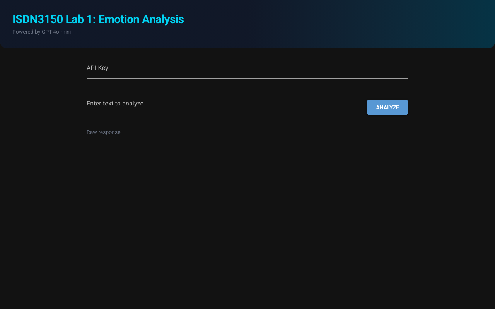

# ISDN3150 Emotion Identification

A web application that performs emotion analysis on text using Azure OpenAI (GPT-4o-mini). Built with [NiceGUI](https://nicegui.io/).

## Features

- **`/`** — Main page where users enter their API key and text for analysis
- **`/admin`** — Pre-fills the API key from the `OPENAI_API_KEY` environment variable (intended to be protected by Cloudflare Access)

Detected emotions: happiness, sadness, anger, surprise, disgust, fear, indifference — displayed as color-coded cards with keywords, reasoning, and confidence scores.

## Screenshot



## Getting Started

### Prerequisites

- Python 3.10+
- An Azure OpenAI API key with access to the HKUST endpoint (`https://hkust.azure-api.net`)

### Local Development

```bash
pip install -r requirements.txt
python kanjo-web.py
```

The app will be available at `http://localhost:8080`.

### Docker

```bash
docker build -t kanjo-web .
docker run -p 8080:8080 kanjo-web
```

To enable the `/admin` page with a pre-filled API key:

```bash
docker run -p 8080:8080 -e OPENAI_API_KEY=your-key-here kanjo-web
```

## Project Structure

| File | Description |
|------|-------------|
| `kanjo-web.py` | NiceGUI web UI — pages, input handling, emotion card rendering |
| `kanjo.py` | Azure OpenAI API client — prompt, function schema, API call |
| `Dockerfile` | Container image (Python 3.11-slim, non-root user) |
| `requirements.txt` | Pinned dependencies (nicegui, openai, python-dotenv) |
| `tests/test_app.py` | pytest suite — schema validation, error handling, color mapping |
| `pyproject.toml` | Ruff and pytest configuration |
| `.pre-commit-config.yaml` | Pre-commit hooks (ruff, trailing-whitespace, codespell) |

## Testing

```bash
pip install pytest
pytest tests/ -v
```

## License

MIT
